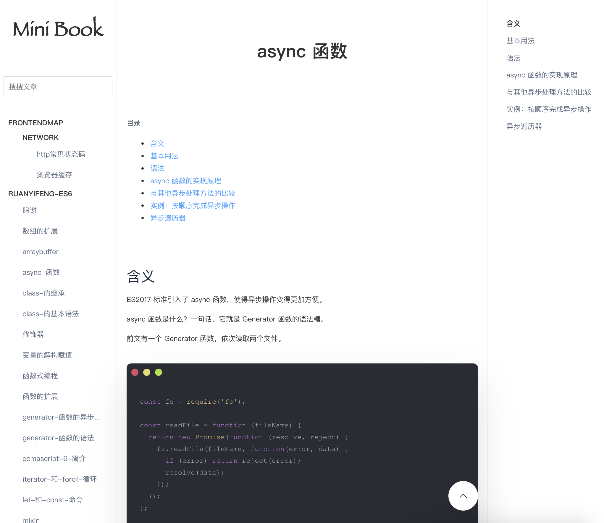

# Mini Book

## 使用

首先将项目 `clone` 到本地：

```
    git clone https://github.com/me1a/mini-book.git
```

然后在项目目录下运行 `npm start` ，启动 [http://localhost:3007](http://localhost:3007)

在 `docs` 目录下写文档，即可同步更新到本地站点。

运行 `npm run build` , 静态资源文件和HTML文档会生成到 `dist` 目录。


## 示例

此处使用 [阮一峰ES6教程](https://github.com/ruanyf/es6tutorial) 和 [You-Dont-Know-JS](https://github.com/getify/You-Dont-Know-JS)作为例子。

网站：[http://www.lome.ink](http://www.lome.ink)
 


## 介绍

**Mini Book** 会将你的 markdown 文档编译成为一个静态站点，让你更专注于写作而无须理会其他。
和服务器端渲染不同的是：**Mini Book** 是将文档先编译好，访问网站时，直接输出HTML页面，极强的提高了访问速度。


**Mini Book** 实现的功能如下：

- [x] 标题锚点，文章标题导航获取到二级标题，可实现点击导航和滚动激活高亮。
  
- [x] Front Matter， 写在 Front Matter 的数据可以注入到每个页面。在这里你可以声明一些你想要的数据：比如页面title，作者，日期，标题，关键词，描述等。

- [x] 目录，**Mini Book** 的目录是基于文件夹 `/docs` 里面的目录的结构，除了无文件的目录不会显示，目录显示的文档名称是文档的一级标题，其他的完全一致
  
- [x] 代码风格， 受[https://carbon.now.sh/](https://carbon.now.sh/) 的影响，起初觉得每次写代码要生成图片，图片的引用也很繁琐，想着直接做一个HTML结构，然后加一点样式。目前是这种效果，但还不够细粒。
  
- [x] 响应式布局，实现了响应式布局。
  
- [x] 全局标题搜索，在构建的时候，已经将所有文章的一二级标题收录，作为一个属性存储在window对象上。搜索功能是静态的搜索。
  
## 目录

- **build** 编译markdown文件的处理脚本
- **dist** 目标输出目录
- **docs** 文档目录
- **template** pug页面模板

